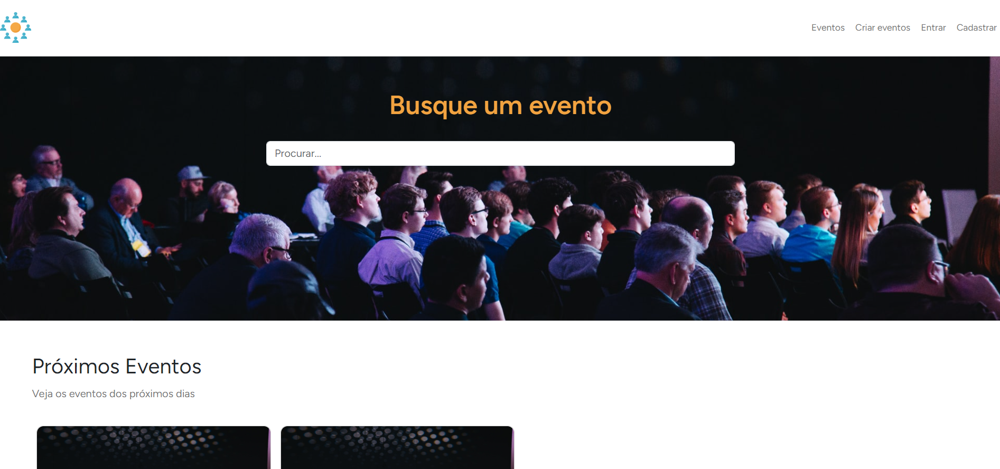

# :desktop_computer: Eventos Application



## :briefcase: Stacks

- HTML/CSS/JavaScript
- PHP/Laravel
- MySQL

## :hammer: Tools

- Git
- PHP
- Composer/Artisan
- VS Code

## :fire: Run

- Development (Port 8000): `php artisan serve`

## :triangular_flag_on_post: Environment Variables

- API URL: `NEXT_PUBLIC_SERVER_API`
- Connection: `DB_CONNECTION`
- Host: `DB_HOST`
- Port: `DB_PORT`
- Database: `DB_DATABASE`
- User: `DB_USERNAME`
- Password: `DB_PASSWORD`

<details>
<summary>:ledger: Banco de dados</summary>

```
  docker exec -it <sevice-name> bash
  mysql -u<user-name> -p<password>
  show databases;
  use <database-name>;
  show tables;
  describe <table-name>;
  docker inspect <service-name> | grep IPAddress
```

</details>
